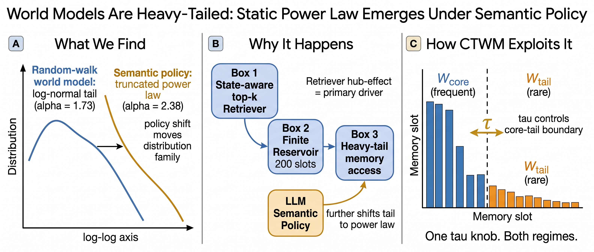
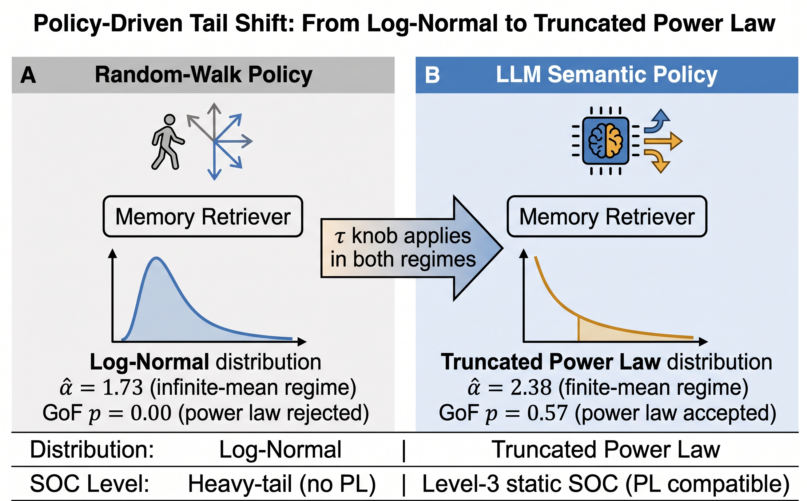
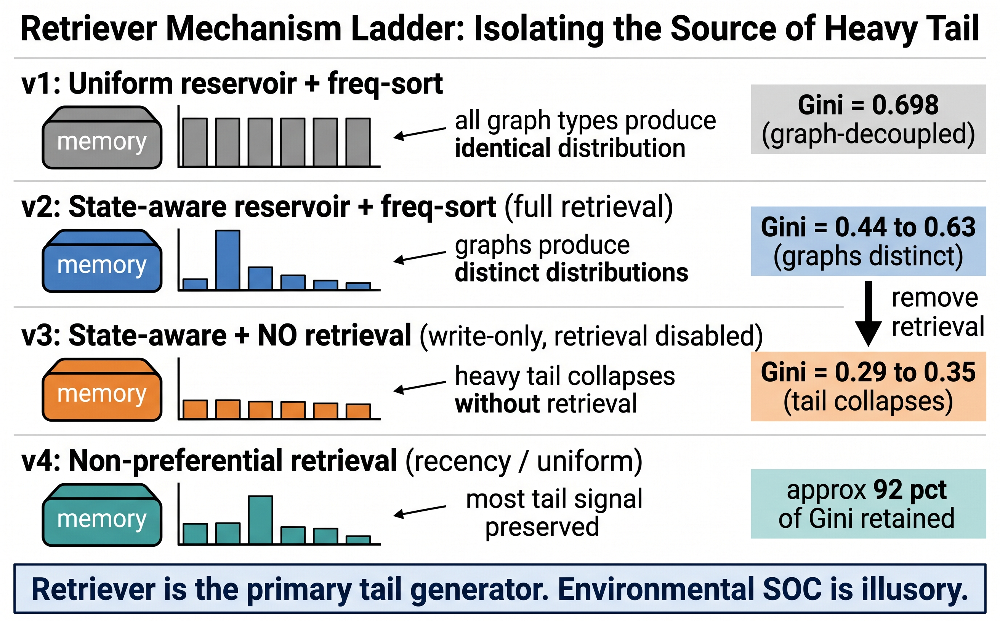
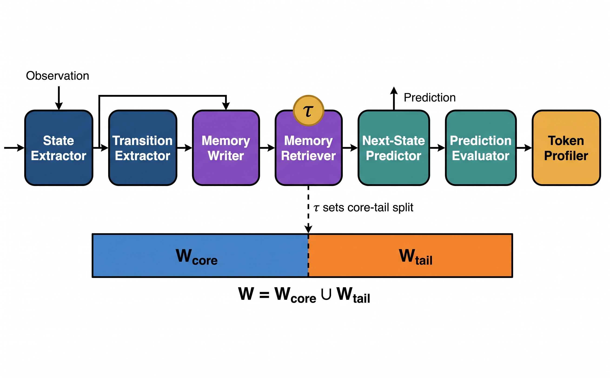

# World Models Are Heavy-Tailed

[](https://www.python.org/)
[](LICENSE)
[](#citation)
[](src/worldmodelsoc)

Official code for **World Models Are Heavy-Tailed: Static Power-Law Emerges Under Semantically-Driven Policy**.

The repository studies whether API-agent world models exhibit self-organized criticality (SOC) signatures in memory access. Random-walk policies produce heavy-tailed log-normal access patterns, while semantically driven LLM policies shift the memory distribution toward a truncated power law. We also include Core-Tail World Model (CTWM), a memory allocation mechanism that uses an external tail coefficient `tau` to trade off core reuse and tail coverage.

## Highlights

- Synthetic graph-world generator for controlled topology, scale, and payload semantics.
- LLM-policy walker experiments with Azure OpenAI-compatible chat completions.
- Memory baselines including full history, sliding window, flat retrieval, frequency cache, recency cache, hierarchical summary, graph memory, and CTWM.
- Distribution-analysis artifacts for log-normal, power-law, truncated power-law, and temporal PSD checks.
- ALFWorld external-validity script for task-level token and tail-retrieval behavior.

## Figures

<p align="center">
  
</p>

**Figure 1.** Intuition for the empirical transition from random-walk log-normal memory access to semantically driven truncated power-law behavior.

<p align="center">
  
</p>

**Figure 2.** LLM-policy pipeline: state payloads, retrieved memory hints, and recent trajectory context are passed to the policy model, which chooses the next graph action.

<p align="center">
  
</p>

**Figure 3.** Retriever ladder used for controlled memory comparisons, from simple history/window baselines to graph-structured retrieval.

<p align="center">
  
</p>

**Figure 4.** Core-Tail World Model (CTWM): high-score core entries are retained for stable reuse, while tau-weighted tail sampling preserves rare but important transitions.

## Repository Layout

```text
worldmodelsoc_code/
├── assets/figures/              # PNG figures used in the README and paper
├── scripts/                     # Reproducible entry points
│   ├── run_random_walk_scaling.py
│   ├── run_llm_policy.py
│   ├── run_method_comparison.py
│   ├── run_ctwm_comparison.py
│   ├── run_tau_sweep.py
│   ├── run_topology_control.py
│   ├── run_seed_ci.py
│   ├── run_frozen_replay.py
│   ├── run_sanity.py
│   └── run_alfworld.py
├── src/worldmodelsoc/           # Importable package
│   ├── env/                     # Synthetic graph world
│   ├── memory/                  # Memory backends and reservoir utilities
│   └── pipeline/                # LLM world-model pipeline modules
├── requirements.txt
├── pyproject.toml
├── CITATION.cff
└── LICENSE
```

## Installation

```bash
git clone <YOUR_REPO_URL>
cd worldmodelsoc_code
python -m venv .venv
source .venv/bin/activate
pip install -r requirements.txt
pip install -e .
```

For ALFWorld:

```bash
pip install -e ".[alfworld]"
```

## API Configuration

LLM-based scripts use an OpenAI-compatible Azure endpoint. Set:

```bash
export AZURE_OPENAI_ENDPOINT="https://YOUR_RESOURCE.services.ai.azure.com/openai/v1"
export AZURE_OPENAI_API_KEY="your-api-key"
export AZURE_OPENAI_DEPLOYMENT="gpt-4o-mini"
```

Alternatively, place the key at `.secrets/azure.key` and keep `.secrets/` untracked.

## Quick Start

Run a CPU-only random-walk scaling smoke test:

```bash
python scripts/run_random_walk_scaling.py \
  --n_steps 1000 \
  --n_nodes 100 \
  --seeds 42 \
  --graph_types scale_free \
  --out_dir results/random_walk_scaling_smoke
```

Run an LLM-policy walk:

```bash
python scripts/run_llm_policy.py \
  --graph_type scale_free \
  --n_nodes 100 \
  --n_steps 2000 \
  --seed 42 \
  --budget_usd 1.0 \
  --out_dir results/llm_policy
```

Compare memory methods:

```bash
python scripts/run_ctwm_comparison.py \
  --n_nodes 100 \
  --n_steps 2000 \
  --seed 42 \
  --tau 1.0 \
  --methods B7_GraphMemory B8_CTWM \
  --out_dir results/ctwm_comparison
```

Sweep the tail coefficient:

```bash
python scripts/run_tau_sweep.py \
  --tau 1.0 \
  --n_steps 2000 \
  --seed 42 \
  --budget_usd 1.0 \
  --out_dir results/tau_sweep
```

## Reproduction Scripts

| Script | Purpose |
|---|---|
| `scripts/run_random_walk_scaling.py` | Random-walk graph scaling across topologies, sizes, and seeds. |
| `scripts/run_llm_policy.py` | Replace random walk with LLM semantic policy on the same graph-world setup. |
| `scripts/run_method_comparison.py` | Compare standard memory baselines under true prompt concatenation. |
| `scripts/run_ctwm_comparison.py` | Compare compact CTWM against graph-memory and cache baselines. |
| `scripts/run_tau_sweep.py` | Study how `tau` changes memory concentration and tail retrieval. |
| `scripts/run_topology_control.py` | Run LLM-policy controls on non-scale-free graph families. |
| `scripts/run_seed_ci.py` | Compute seed confidence intervals for graph memory and CTWM. |
| `scripts/run_frozen_replay.py` | Replay frozen trajectories to separate encoding effects from path variance. |
| `scripts/run_alfworld.py` | External-validity run on ALFWorld tasks. |

## Expected Artifacts

Each run writes JSON/JSONL artifacts under the requested `--out_dir`, typically:

- `*_mem_counts.json`: memory access frequency counts.
- `*_state_counts.json`: state visitation frequency counts.
- `*_trans_counts.json`: transition frequency counts.
- `*_mem_time.jsonl`: temporal memory-access sidecar for PSD analysis.
- `*_actions.jsonl`: LLM policy audit trail.
- `*_meta.json`: summary statistics, token accounting, and distribution-fit fields.

## Key Results Reported in the Paper

| Result | Summary |
|---|---|
| Random-walk access | Log-normal better explains random-walk memory access across controlled graph scales. |
| LLM-policy access | Semantically driven action choice yields truncated-power-law-compatible memory access. |
| CTWM efficiency | CTWM reduces prompt tokens while improving tail retrieval relative to graph memory. |
| Tau control | Increasing `tau` monotonically changes concentration statistics such as Gini and max/median. |
| External validity | ALFWorld runs preserve the same token/tail-access trend beyond synthetic graphs. |

## Citation

```bibtex
@article{anonymous2026worldmodelsoc,
  title   = {World Models Are Heavy-Tailed: Static Power-Law Emerges Under Semantically-Driven Policy},
  author  = {Anonymous Authors},
  journal = {Under review},
  year    = {2026},
  url     = {https://github.com/your-org/worldmodelsoc_code}
}
```

## License

This project is released under the MIT License. See [LICENSE](LICENSE).
